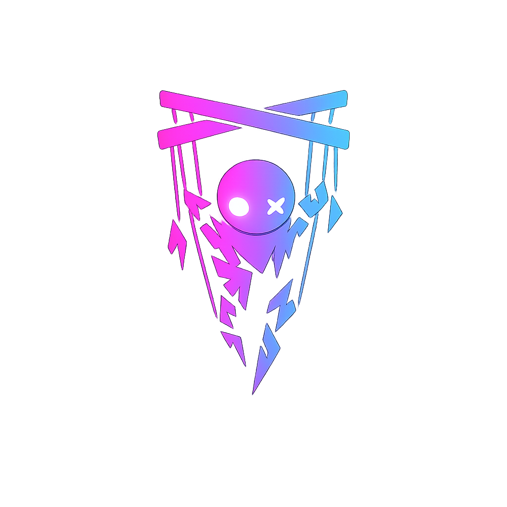

<p align="center">
  
</p>

<h1 align="center">Puppet</h1>

<p align="center">A modular NPC framework for Roblox.</p>

<p align="center">
  <a href="https://crossbeast.github.io/Puppet/">Documentation</a> &middot;
  <a href="https://create.roblox.com/store/asset/139690896215004/Puppet">Creator Store</a>
</p>

---

Puppet is an NPC framework where at its base, provides the basic capabilities that most NPCs share which are divided into two types (Core and Action), which at its base include — movement, pathfinding, perception, patrol, wander and follow. You compose behaviors from these components and orchestrate them to fit your game's specific needs.

## Base Components

| Component | Type | What it does |
|-----------|------|-------------|
| **Movement** | Core | Pathfinding, WalkTo, stuck detection |
| **Perception** | Core | Vision cone, threat tracking, hearing |
| **Patrol** | Action | Loops through waypoints |
| **Wander** | Action | Picks random points in a radius |
| **Follow** | Action | Tails a target model |
| **Idle** | Action | Does nothing |

## Quick start

```lua
local Puppet = require(game.ServerScriptService.Puppet)

local npc = Puppet.new(npcModel, {
    movement = { walkSpeed = 14 },
    patrol = {
        points = { pointA, pointB, pointC },
        waitTime = 1.5,
    },
})
```

Want it to notice intruders? Add perception:

```lua
npc:AddComponent("Perception", { visionRange = 40, threatTags = { "Player" } })
```

Want it to chase them? Swap the action:

```lua
npc:SetAction("Follow", { target = intruder, distance = 5 })
```

## Links

- [Documentation](https://crossbeast.github.io/Puppet/) — Full API reference, tutorial, and troubleshooting
- [Roblox Creator Store](https://create.roblox.com/store/asset/139690896215004/Puppet) — Install directly into Studio

## Credits

- [Signal](https://sleitnick.github.io/RbxUtil/api/Signal/) by stravant & sleitnick (MIT License)
- [Trove](https://sleitnick.github.io/RbxUtil/api/Trove/) by sleitnick (MIT License)
